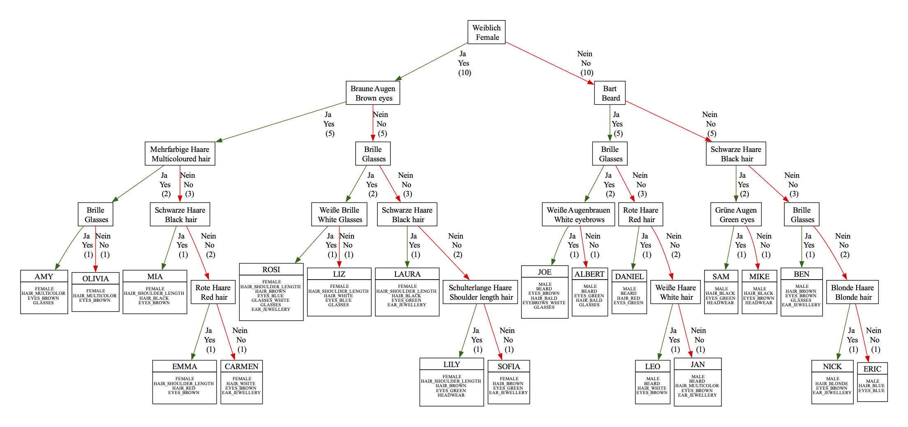

# A Decision-Tree for the Game 'Guess Who?'

"Guess Who?" is a classic two-player board game developed by Hasbro. The goal of the game is for players to guess which character their opponent has chosen from a lineup of possibilities by asking yes-or-no questions. Here’s how the game is typically played:

## Game Components

* **Game Boards:** Each player has a board with 24 character faces and names. Each face can be flipped up or down.
* **Character Cards:** Each player draws a card at the start of the game that features a character from the board.
* **Deck of Mystery Cards:** This contains the same set of characters as those on the boards.

## Setup

1. **Choose a Character:** Each player selects a character card from the deck without showing it to the other player. This is the character the opponent has to guess.
2. **Arrange the Game Board:** Each player sets up their game board with all 24 characters visible.

## Gameplay

1. Ask Questions: Players take turns asking yes-or-no questions to narrow down the possibilities of who the opponent's mystery character could be. For example, a player might ask, "Does your character wear glasses?"
2. Eliminate Characters: Based on the answer, the player flips down the characters on their board that do not match the answer. If the answer to the question is "yes," the player flips down all characters who do not have the feature asked about, and vice versa.
3. Guess the Character: Once a player feels confident that they know who the opponent's character is, they can make a guess instead of asking a question. If the guess is correct, that player wins the game. If the guess is incorrect, the other player wins.

## Winning the Game

The objective is to guess the opponent’s mystery character correctly before they guess yours.

## Strategy

* **Ask Broad Questions First:** Start with general questions to eliminate as many characters as possible. For instance, ask about gender, hair color, or accessories.
* **Narrow Down Quickly:** As the game progresses, refine questions to get more specific and quickly zero in on the opponent’s character.
* **Memory and Deduction:** Keep track of the answers to previous questions to avoid asking redundant or irrelevant questions.

"Guess Who?" is a game of deduction, memory, and strategy, designed to be easy to learn and enjoyable for both children and adults.

# Editions

"Guess Who?" has been released in several editions and variations since its original release, each offering unique twists or themes to the classic gameplay.

## Classic Editions

* **Original Edition:** The classic version features 24 distinct characters with various attributes such as hair color, eye color, and accessories.
* **Travel Edition:** A compact version of the game designed for portability and travel convenience, typically featuring a smaller board with fewer characters.

## Themed Editions

* **Disney Edition:** Features popular Disney characters instead of the traditional lineup, allowing players to guess characters like Mickey Mouse, Cinderella, and others.
* **Marvel Edition:** Includes Marvel superheroes and villains, where players guess iconic characters such as Spider-Man, Iron Man, and Captain America.
* **Star Wars Edition:** Set in the Star Wars universe, featuring characters from the movies like Luke Skywalker, Darth Vader, and Yoda.
* **Harry Potter Edition:** Based on the Harry Potter series, allowing players to guess characters like Harry Potter, Hermione Granger, and others from the wizarding world.

## Special Editions

* **Electronic Guess Who?:** An electronic version with sound effects and sometimes voice interaction, offering a modern twist on the classic gameplay.
* **Guess Who? Mix and Mash:** Allows players to mix and match character features to create new faces, adding more variety and replayability.
* **Guess Who? Extra:** Features additional characters and electronic sound effects, often with a wider array of questions and interactions.
* **Guess Who? Flip 'n' Find:** A version that introduces new mechanics or board designs to keep the game fresh and interesting.

## Modern Adaptations

* **App Versions:** Digital versions of the game are available on various platforms, including smartphones and tablets, allowing for single-player and multiplayer modes.
* **Online Versions:** Websites and online platforms offer versions of "Guess Who?" that can be played against other players over the internet.

These editions and variations provide different themes and gameplay experiences while maintaining the core mechanics of the original "Guess Who?" game. They offer something for fans of various franchises and provide fresh challenges for seasoned players.

# What problems can occur when playing?

While "Guess Who?" is a straightforward and enjoyable game, a few potential issues and challenges can arise during gameplay. Here are some common problems and suggestions for addressing them:

## 1. **Vague or Misleading Questions**

- **Problem:** Players may ask questions that are too vague, leading to confusion or disagreement about how to interpret the answer. For example, questions about subjective attributes (like attractiveness) can be problematic.
- **Solution:** Encourage players to ask clear, objective questions. Clarify any ambiguous questions or terms before answering, and establish guidelines for acceptable questions if needed.

## 2. **Accidental Revealing of the Mystery Character**

- **Problem:** Players might accidentally reveal their mystery character by flipping the wrong card or through their reactions.
- **Solution:** Encourage players to be mindful and deliberate in their actions and reactions. Practice keeping a "poker face" to avoid giving away unintentional clues.

## 3. **Repetitive Gameplay**

- **Problem:** The game can become repetitive, especially with frequent play, as players might use the same questions repeatedly.
- **Solution:** Introduce house rules or variations to add complexity or change the dynamics. For example, limit the number of questions or introduce a time limit for each turn to increase the challenge.

## 4. **Disagreement Over Character Features**

- **Problem:** Players may disagree on whether certain characters have specific features, such as ambiguous hairstyles or unclear accessories.
- **Solution:** Before starting the game, players can review the character cards together and agree on any ambiguous features. This helps prevent disputes during the game.

## 5. **Limited Number of Characters**

- **Problem:** The original game has a limited set of characters, which might make it easier to guess the opponent's character with fewer questions.
- **Solution:** Consider playing with themed editions that offer different characters or use expansion packs if available. Alternatively, create custom characters or boards to increase variety.

## 6. **Losing Pieces**

- **Problem:** Small game pieces, such as character cards or board components, can be easily lost, disrupting future gameplay.
- **Solution:** Keep the game stored in a secure, designated area and make a habit of counting and organizing pieces after each game session to ensure nothing is missing.

## 7. **Younger Players Struggling**

- **Problem:** Younger children might struggle with formulating strategic questions or understanding the game mechanics fully.
- **Solution:** Pair younger players with more experienced ones who can guide them, or simplify the rules to make the game more accessible and enjoyable for them.

By being aware of these potential issues and implementing some of the suggested solutions, players can enhance their "Guess Who?" experience, ensuring it remains fun and engaging for everyone involved.

# What is this project about?

Our household recently purchased the "Grab and Go" travel version of the game.

Because this is a travel version, the pictures on the flaps are tiny. Since we play with children (<6 years old), there are always problems identifying the different features of the characters. People now have multicolored hair. Instead of having light- and dark-skinned characters, Hasbro has introduced at least 11 different skin tones in this variant, where it is a matter of discussion where to separate "light" and "dark".

Games often lead to false exits because you didn't recognize the 7th person, who has earrings that are less than a millimeter in size and very hard to recognize. As a real travel game in a moving train or car, the whole thing becomes even more difficult.

To find out if there are enough consistent features to play the game, I collected the features of the people in the discussion with the family. A piece of software was then developed that attempts to create a decision tree with the currently selected features.

A decision tree that omits "ambiguous" features in the game can be found in this repository as "GuessWhoGrabAndGoEditionGame.pdf".

